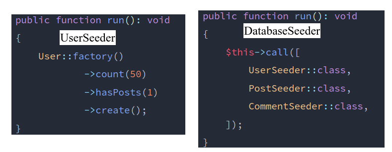
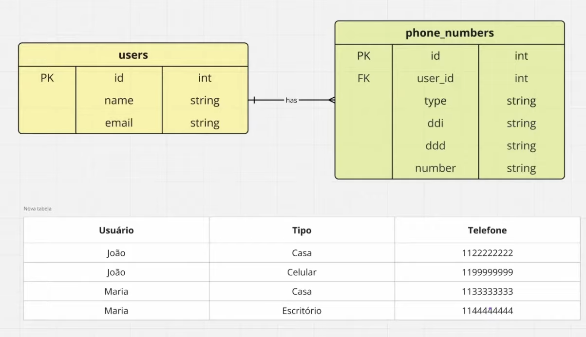
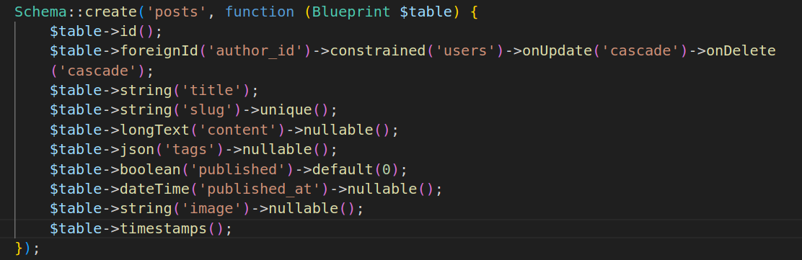
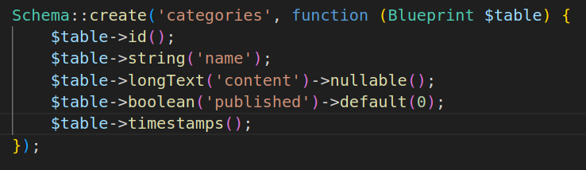
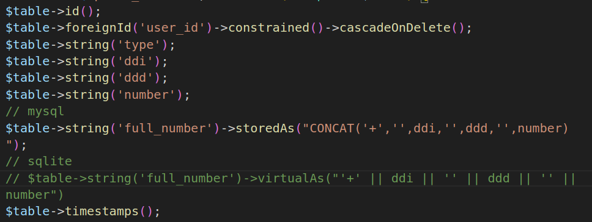
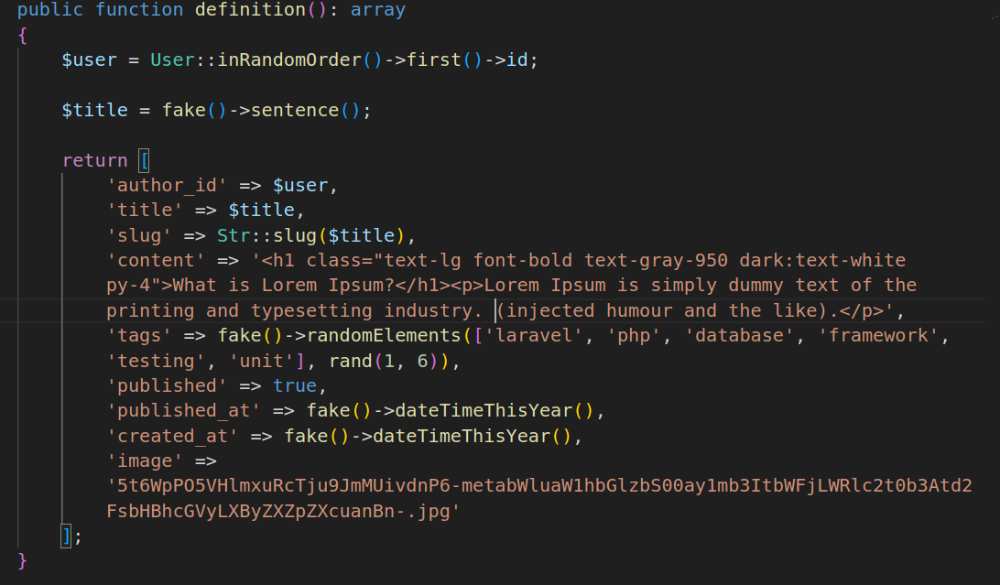
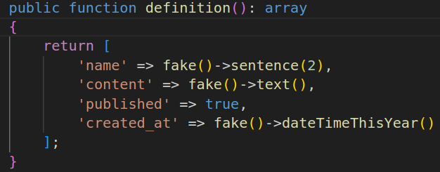

# Relacionamento HasMany
- [Relacionamento HasMany no Filament](https://youtu.be/gIctqfUJshM?si=bC7bmGeonBOj41o1)
- [Colunas virtuais](https://youtu.be/MqBExduNWAU?si=FPmi_ul9kBJ2RTkY)
## Requisitos
- Laravel 11
- PHP 8.3
- Filament
## Instalação
```sh
composer require filament/filament:"^3.2" -W
php artisan filament:install --panels
php artisan migrate
php artisan make:filament-user # user: admin@admin.com password: 123456
```
## Rodar
```sh
php artisan serve
php artisan make:seeder UserSeeder
php artisan db:seed
```


## Projeto


## Criar Resource de User, Post e Category
```sh
# Criar Model Post
php artisan make:model Post -m
# editar migration
```

```sh
# Criar Model Category
php artisan make:model Category -m
# editar migration
```

```sh
# executar migration
php artisan migrate
# Criar Resources
php artisan make:filament-resource PostResource --generate
php artisan make:filament-resource CategoryResource --generate
php artisan make:filament-resource UserResource --generate
# Criar migration
php artisan make:migration create_category_post_table
# Criar model e migração: PhoneNumber
php artisan make:model PhoneNumber -m
# Editar a migrattio
```

```sh
php artisan migrate
# criar resource
php artisan make:filament-resource PhoneNumber --generate --simple
# criar seed de usuarios, post me categorias
php artisan make:seeder UserSeeder

php artisan make:seeder PostSeeder
php artisan make:factory PostFactory
```

```sh
php artisan make:seeder CategorySeeder
php artisan make:factory CategoryFactory
```

```sh
php artisan db:seed
php artisan storage:link
php artisan make:filament-relation-manager
# UserResource, phoneNumbers, full_number

```
